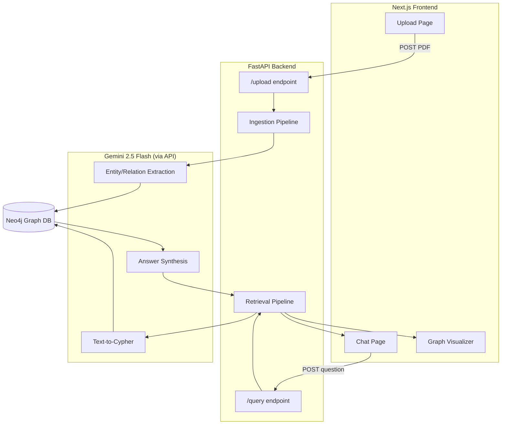
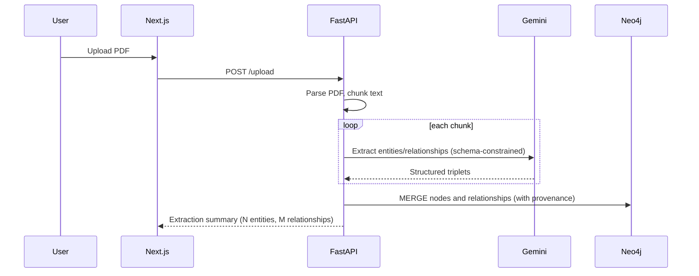
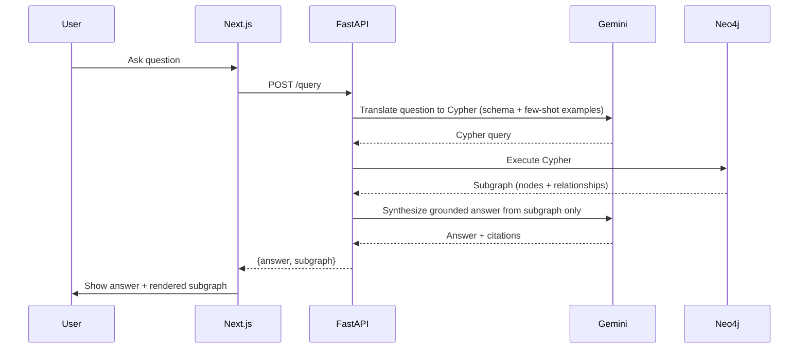
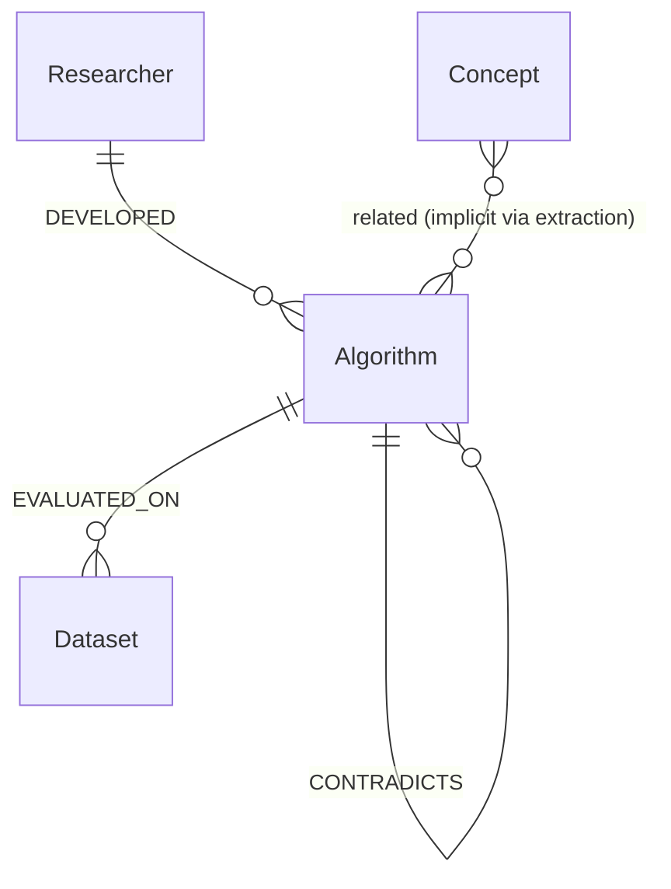

# System Architecture

## High-Level Component Diagram

## Ingestion Pipeline (Sequence)

## Query Pipeline (Sequence)

## Data Model

**Node types (fixed schema):** `Researcher`, `Algorithm`, `Dataset`, `Metric`, `Concept`

**Relationship types (fixed schema):** `DEVELOPED`, `EVALUATED_ON`, `IMPROVES`, `CONTRADICTS`

> Do not add node/relationship types outside this list without explicit instruction. If extraction consistently misses a real relationship in the source text because the schema doesn't cover it, flag this rather than silently expanding the schema.

## Component Responsibilities

| Component | Responsibility |
|---|---|
| Next.js frontend | PDF upload UI, chat UI, graph visualization of retrieved subgraphs |
| FastAPI backend | Orchestrates ingestion and query pipelines; exposes `/upload` and `/query` |
| LangChain (extraction) | Wraps Gemini calls for structured triplet extraction from text chunks |
| LangChain (retrieval) | Wraps Gemini calls for text-to-Cypher generation and answer synthesis |
| Neo4j | Stores the knowledge graph; executes Cypher traversal queries |
| Gemini 2.5 Flash | Performs all extraction, query translation, and generation reasoning |

## Why This Stack (for when the agent needs to justify a choice)

- **Neo4j over a relational DB or in-memory graph library:** native graph storage makes multi-hop traversal a constant-time operation regardless of database size, versus deeply nested joins in a relational schema. This directly serves the lineage-tracing feature.
- **LangChain over hand-rolled prompt code:** standardizes extraction (`LLMGraphTransformer`) and retrieval (`GraphCypherQAChain`) patterns instead of reimplementing prompt templates and response parsers from scratch. It is a thin orchestration layer — it is not doing anything conceptually novel, just saving reimplementation.
- **Gemini 2.5 Flash:** large context window reduces the need for extremely aggressive chunking, lowering the risk of splitting a described relationship across two chunks.
- **FastAPI:** native async support matters because both pipelines are I/O-bound (LLM calls, DB queries); automatic validation from type hints reduces boilerplate.
- **Docker for Neo4j:** isolates the database from host configuration, makes resets trivial during development, mirrors real deployment patterns.
